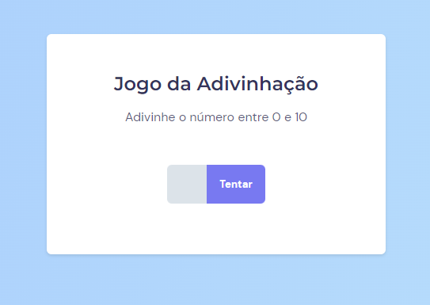

 

  

  <h3 align="center">Jogo da Adivinhação</h3>

  

    Um jogo de adivinhar o número.
     
    <a href="https://clmateus.github.io/Jogo-da-Adivinhacao" />Veja esse projeto na Web!</a>
  

## Sobre o projeto

Um jogo feito em HTML, CSS e Javascript onde o objetivo é adivinhar um número aleatório.

Neste projeto pude desenvolver algumas habilidades como:
* HTML semântico
* CSS responsivo
* Javascript
* Document Object Model (DOM)
* Eventos
* Funções
* Tratamento de bugs

Sinta-se livre para me mandar uma mensagem caso perceba algum ponto onde posso melhorar! 

### Construído com

* 
* 
* 

## Contato

### Mateus Costa 👨🏻‍💻
* cl.mateuscosta@gmail.com
* [![LinkedIn][linkedin-shield]][linkedin-url]
* [![Github][github-shield]][github-url]
* Veja esse projeto na web: [Jogo da Adivinhação](https://clmateus.github.io/Jogo-da-Adivinhação)

(<a href="#readme-top">Voltar ao início</a>)

[github-shield]: https://img.shields.io/badge/github-%23121011.svg?style=for-the-badge&logo=github&logoColor=white
[github-url]: https://github.com/clmateus
[linkedin-shield]: https://img.shields.io/badge/-LinkedIn-black.svg?style=for-the-badge&logo=linkedin&colorB=555
[linkedin-url]: https://linkedin.com/in/clmateus

https://github.com/othneildrew/Best-README-Template/blob/master/README.md#readme-top
https://github.com/Ileriayo/markdown-badges
